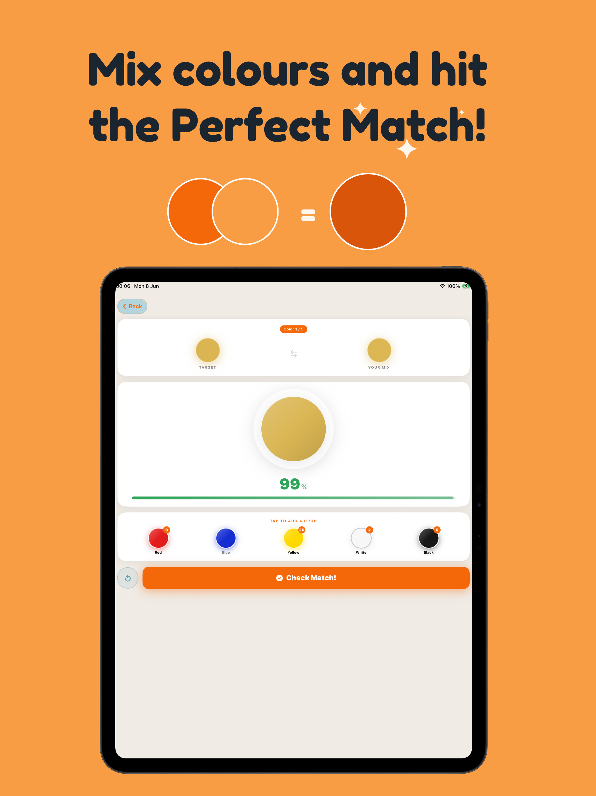
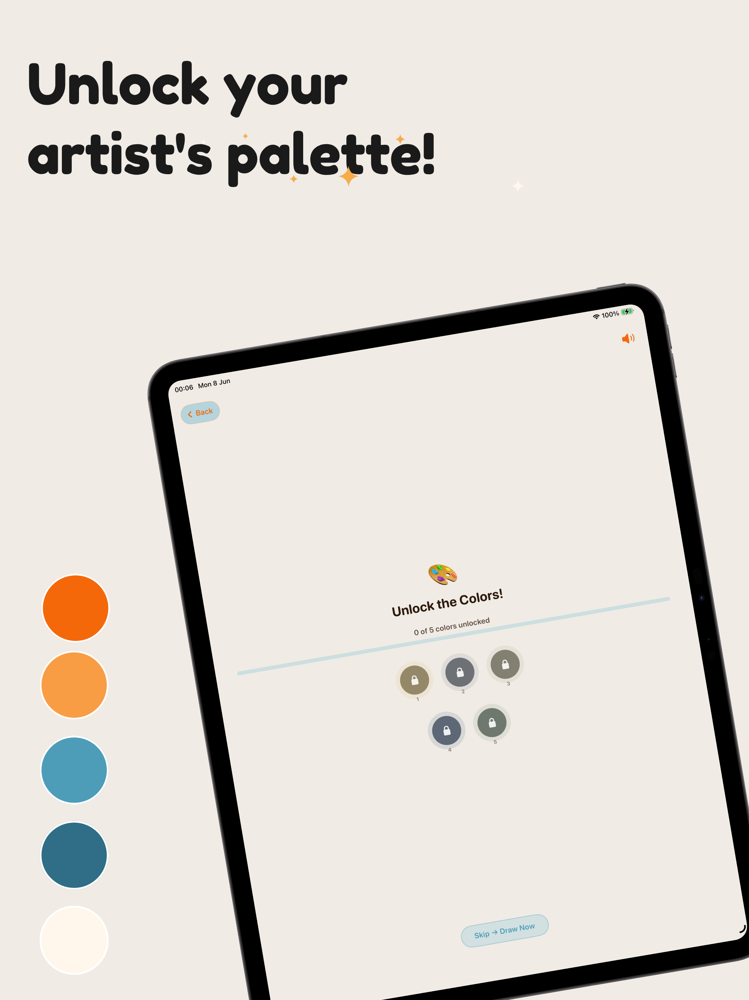
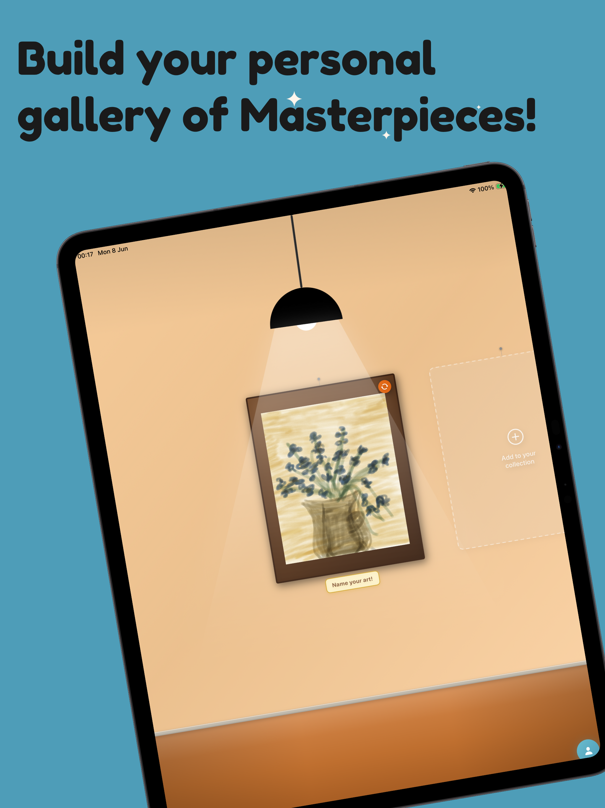

# Tinto — Your Museum Buddy

<table>
  <tr>
    <td width="160">
      
    </td>
    <td>
      <strong>Tinto</strong> transforms museum visits into creative, color-driven experiences for children aged 6–11.<br/><br/>
      Point your camera at any artwork and Tinto instantly extracts its dominant colors, revealing the hidden palette behind every painting. Use those colors to mix, match, and create your own masterpieces — on a touch canvas or through AR hand tracking in the air.<br/><br/>
      📱 Available on <strong>iPhone and iPad</strong><br/>
      🛠 iOS 16.0+<br/>
      🌐 English & Italian<br/><br/>
      🔗 <a href="https://apps.apple.com/app/tinto-your-museum-buddy/id6777824863">Download on the App Store</a>
    </td>
  </tr>
</table>

---

### iPad

<table>
  <tr>
    <td></td>
    <td></td>
    <td></td>
    <td></td>
  </tr>
</table>

---

## Features

- **Scan a painting** — point the camera at any artwork; Tinto extracts its dominant colors and detects its style on-device
- **Mix to unlock** — a color-mixing mini-game (red, yellow, blue, white, black) where kids match a target color to add it to their palette, with stars, streaks, and a bit of celebration when they nail it
- **Two ways to paint**
  - Touch canvas — finger or Apple Pencil (PencilKit)
  - AR canvas — the child's hand becomes the brush, painting in the air
- **Personal gallery** — finished paintings are saved to a flippable wall alongside the original artwork photo
- **Badges** — small milestones tracked locally (first painting, color master, gallery star, and more)
- **Sharing** — export a single painting or the whole gallery through the standard iOS share sheet
- **Fully localized** — English and Italian, switchable from inside the app
- **Light and dark appearance**, custom avatar, name, and age

## Tech stack

- Swift and SwiftUI, targeting iOS 16.0+
- PencilKit for the touch drawing canvas
- AVFoundation for camera capture and color extraction
- On-device art-style detection — heuristic on iOS 16+, with an optional FoundationModels path on iOS 26+
- AudioToolbox for lightweight sound effects — no audio asset files, no third-party libraries
- FileManager-based local storage for paintings, photos, and metadata — nothing leaves the device

No third-party dependencies are used anywhere in the project.

## Project structure

```
Tinto/
├── TintoApp.swift                   # App entry point
├── RootView.swift                   # Root navigation / onboarding gate
├── OnboardingView.swift             # First-launch onboarding flow
├── CameraScreen.swift               # Artwork scanning
├── ColorExtractor.swift             # Dominant color extraction
├── ArtStyleDetector.swift           # Style detection (heuristic + FoundationModels)
├── PaintingStyleDetector.swift      # Supporting style classification logic
├── ColorGameView.swift              # Color-mixing mini-game
├── ColorPreviewScreen.swift         # Color palette preview
├── CanvasSelectionView.swift        # Choose how to paint
├── TouchCanvasView.swift            # Finger / Apple Pencil canvas (PencilKit)
├── CreationCanvas.swift             # AR painting canvas
├── MuseumStore.swift                # Persistence and session state
├── MuseumWallView.swift             # Personal gallery wall
├── MuseumWallBackground.swift       # Gallery background rendering
├── ArtworkDetailSheet.swift         # Artwork detail / edit / share / delete
├── ProfileSheet.swift               # Profile, stats, badges, settings
├── Badges.swift                     # Achievement system
├── SoundManager.swift               # Sound effects (AudioToolbox)
├── Localization+AppLanguage.swift   # In-app language switching
├── Color+Hex.swift                  # Brand color definitions
├── ColorMath.swift                  # Color blending utilities
├── FontExtension.swift              # Custom font (Fredoka) registration
├── CodedPictureFrames.swift         # Frame rendering
├── FrameStyle.swift                 # Frame style definitions
├── SpotlightsView.swift             # Decorative spotlight animations
├── en.lproj / it.lproj             # Localized strings
└── AnimationExtensions/             # Confetti, button styles, small animations
```

## Privacy

There are no accounts, no sign-in, and no analytics. Everything a child creates — paintings, photos, progress — stays on the device.

## License

All Rights Reserved. This repository is a portfolio overview only — the project's source code is maintained in a private repository.
